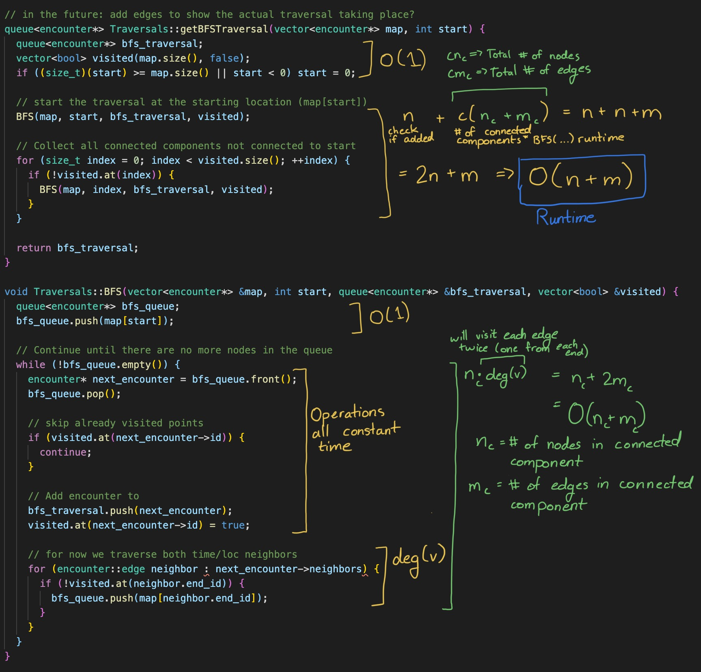
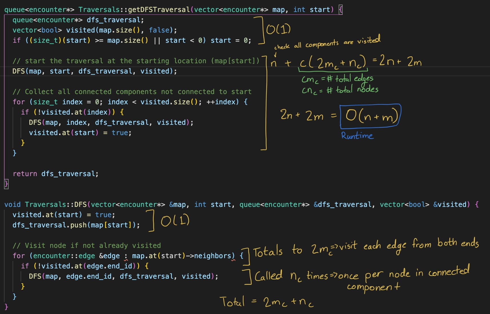
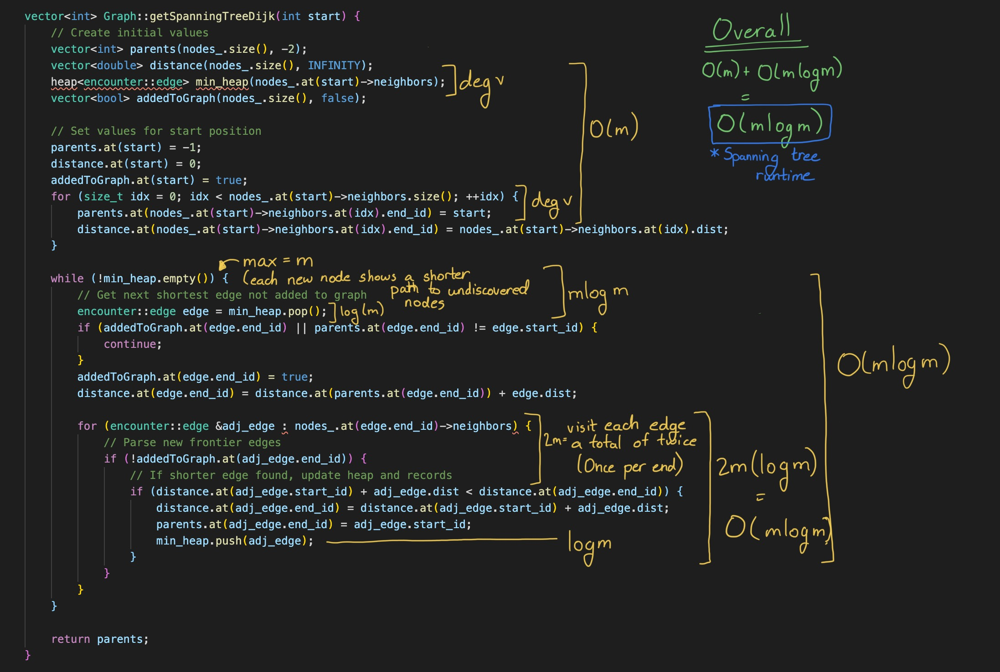
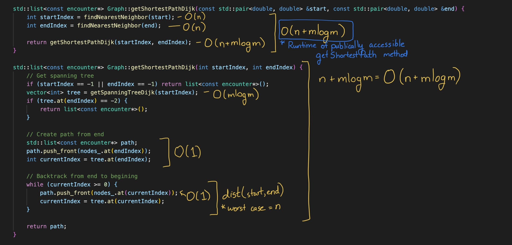

# CS 225 Data Structures
## Results (ahqiu2-pzy2-jvonahn2-merchia2)

## Final Deliverables
  1. [Traversals](#traversals)
  2. [Spanning Tree](#spanning-tree)
  3. [Shortest Path Algorithm](#shortest-path-algorithm)
  4. [Centrality Algorithm](#centrality-algorithm)

Each section of a deliverable will cover the following topics in order: 
1. Runtime
2. Discoveries
3. Proof of Correctness

### Traversals
1. Runtime

    **Runtime: O(n + m)**

    **Proof for BFS:** 
        
    **Proof for DFS:** 
        

2. Discoveries

   * 

3. Proof of Correctness

### Spanning Tree
1. Runtime
   
    **Runtime: O(mlogm)**

    **Proof:**
    

2. Discoveries
3. Proof of Correctness

### Shortest Path Algorithm

1. Runtime

    **Runtime: O(n + mlogm)**

    **Proof:**
    

2. Discoveries
3. Proof of Correctness

### Centrality Algorithm

1. Runtime
2. Discoveries
3. Proof of Correctness